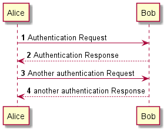

# MD2Word
**MD2Word** is a markdown to Microsoft Word converter for .NET. It is based on [markdig](https://github.com/xoofx/markdig) markdown processor.
It create Word document, based on the predefined template. 

## Supported Features
* Headings
* Number lists
* Bullet lists
* Hyperlinks
* Emphasis
* Embedding images from local drive, web (including svg)
* [UML diagrams](http://plantuml.com/) 
* Code blocks (with syntax highlighting)
* Thematic break
* Quotes
* Tables (without span of cells, and table style is still hardcoded)

## Requirements
### Java
Install [Java](https://java.com/en/download/). Ensure that the JAVA_HOME environment variable is set.

## Documentation
### Template Document
It can be any *.docx document, where all required styles are defined:
* Body text
* Code text
* Caption
* Code block
* Heading
* Number list
* Bullet list
* Hyperlink.

> Nesting levels haven't been supported for lists yet.

You need to ensure that **all used styles** are really **saved in the word document**. For that you need to simply write some dummy text, apply style on to it and save document.
Then you can cleanup your template.

If table of content is needed, it shall be specified in the template. ([How to add ToC](https://support.microsoft.com/en-us/office/insert-a-table-of-contents-882e8564-0edb-435e-84b5-1d8552ccf0c0?ranMID=46131&ranEAID=a1LgFw09t88&ranSiteID=a1LgFw09t88-68oREsmQq6oy2mg5nf3Juw&epi=a1LgFw09t88-68oREsmQq6oy2mg5nf3Juw&irgwc=1&OCID=AID2200057_aff_7806_1243925&tduid=%28ir__2tpk1l20p0kf6xkogy0hdlxbqu2xo3xsfhjzraef00%29%287806%29%281243925%29%28a1LgFw09t88-68oREsmQq6oy2mg5nf3Juw%29%28%29&irclickid=_2tpk1l20p0kf6xkogy0hdlxbqu2xo3xsfhjzraef00)).

Following placeholders must be specified:
* Title
  * MD heading level 1 is interpreted as document title 
* Brief document description (text with @brief keyword)
  * Example: "@brief Short description of the document."
* Body.

Placeholder is specified by [Rich Text Content Control](https://www.thewindowsclub.com/dd-and-change-content-controls-in-word) with appropriate tag (case sensitive):
* title
* brief
* body.

All placeholders are removed after document generation.

Please see for reference [template example](template_example.docx).

### UML diagrams
In order to use UML, [PlantUML](http://plantuml.com/) notation shall be used. UML block shall be started with **@startuml** and ended with **@enduml** keywords.
#### Example:
```markdown
@startuml
'https://plantuml.com/sequence-diagram

autonumber

Alice -> Bob: Authentication Request
Bob --> Alice: Authentication Response

Alice -> Bob: Another authentication Request
Alice <-- Bob: another authentication Response
@enduml
```
As result UML diagram will be generated in the final document and pasted as a picture:



### Configuration
All styles from template shall be mapped in the [appsettings.json](MD2Word.App/appsettings.json) like as follow:
```json
{
"Styles": {
    "BodyText": "Normal",
    "CodeText": "Code Text",
    "Caption": "Subtitle",
    "CodeBlock": "Code",
    "Heading": "Heading {0}",
    "NumberList": "List Number",
    "BulletList": "List Bullet",
    "Hyperlink": "Hyperlink"
    }
}
```

### CLI 
| Short key | Long key   | Description                                                                                                      |
|:--------- |:---------- |:---------------------------------------------------------------------------------------------------------------- |
| -t        | --template | **Required**. Word document (*.docx), which is used as template for document generation                          |
| -m        | --markdown | **Required**. Input markdown file                                                                                |
| -o        | --output   | _Optional_: Output file name. It shall be specified if output name shall differ from the name of markdown file   |
|-d         | --dir      | _Optional_: Output directory, otherwise document will be generated nearby markdown file                          |

